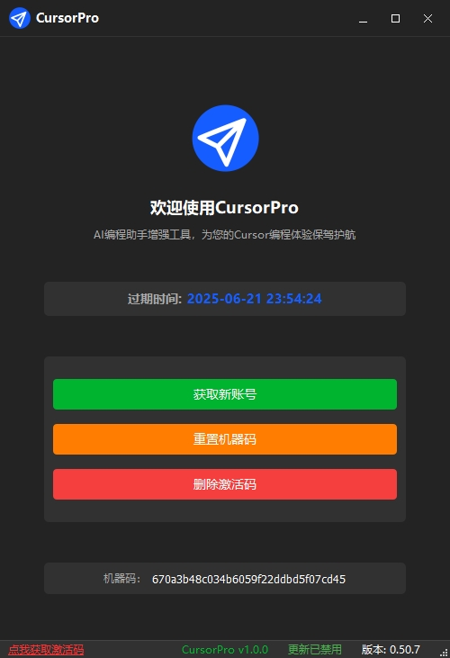

## ✨ 简介

🎯 **CursorPro** 是一款 **完全免费** 的工具，专为自动获取新账号、一键重置新额度、解决机器码问题而设计，支持无限续杯，极简使用体验！

🛠️ 工具亮点：

- 🔓 无需注册使用 Claude 3.7  
- ⚡ 一键获取新额度  
- 📦 自动满额度账号分配  
- 💻️ 无需登录自己账号  
- 🔁 顺带自动解封机器码  

---

## ⚠️ 注意事项

🚨 **使用前，请先随便用一个账号登录一次 Cursor 软件**，确保系统初始化正常，否则部分功能可能无法正常运行。

---

## 🖼️ 截图展示

---

## 📦 下载使用

### 🔽 直接下载可执行文件

📁 前往 [📥 Releases 页面](https://github.com/FFMSR/CursorPro/releases) 下载最新版本的 `CursorPro.exe`，双击即可运行，无需安装！

---

## 🤝 加入微信群获取更新 & 交流学习

📱 扫码加入微信群，获取最新版本下载链接、使用技巧及问题解答👇

